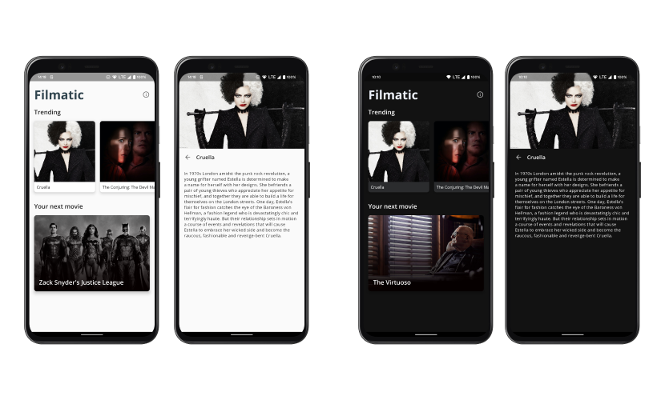
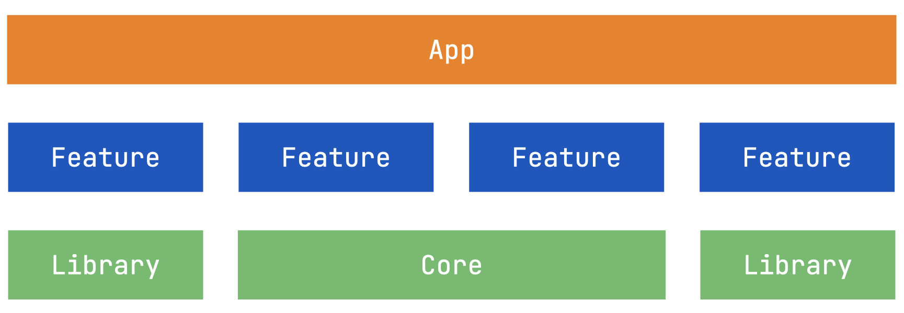
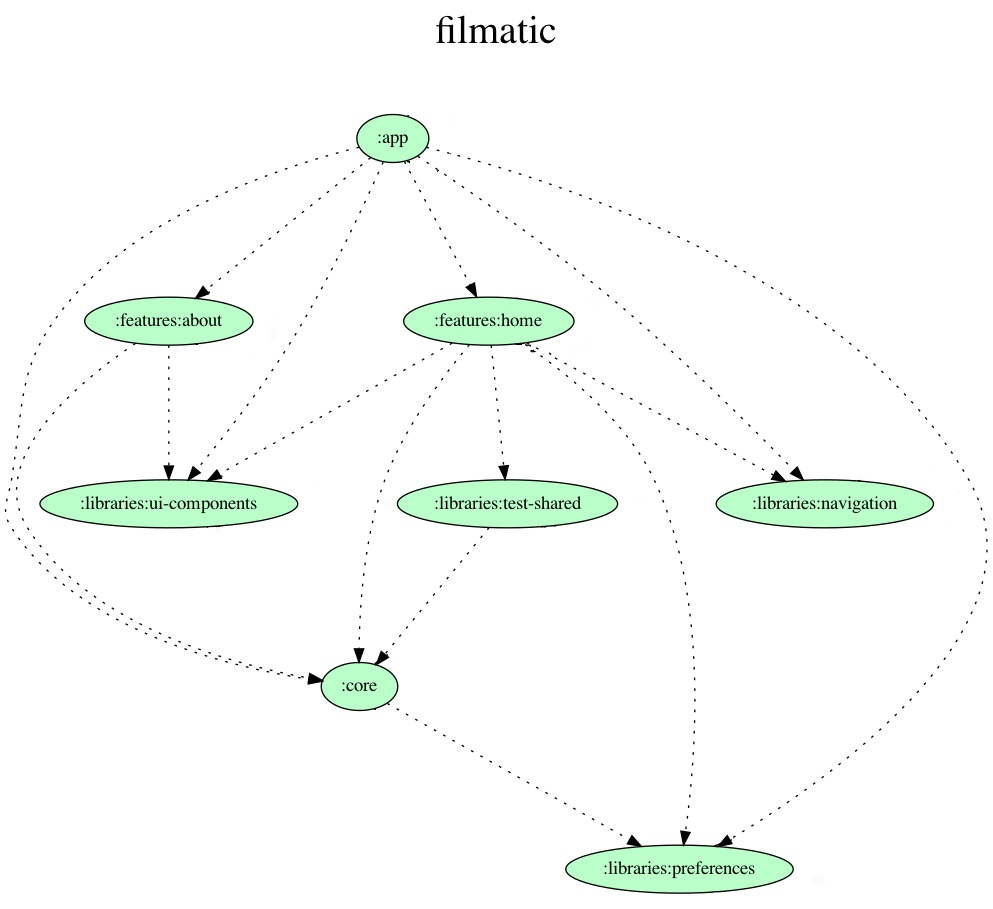

# Filmatic

Filmatic shows you some popular movies of the moment. The project is a playground application that I use 
to catch up with modern Android development. In particular, I've used it to learn modularization and 
Dependency Injection with [Dagger](https://dagger.dev/) and then [Hilt](https://dagger.dev/hilt/).

<div align="center">
  
</div>

## Modular Architecture 🧩

As mentioned, the app uses a multi-modular project structure. A module can be of 3 different types:

- Library module
- Feature module
- App Module

<div align="center">
  
</div>

A **library module** can be an Android or a pure Kotlin module. A library module never depends on a feature or an app module, 
but it can depend on another library. Library modules can contain different functionalities, for example 
UI components, data storage, networking, analytics, etc.

A **feature module** is an Android library that contains a specific feature of the app. For example,
the onboarding flow, the home screen, the settings, etc. A feature module never depends on other feature modules 
or on an app module. However, it depends on many libraries module

The **app module** is an Android Application and it links all the modules together. For that reason it 
depends on other feature and library modules.

Filmatic is composed of different feature and library modules:

<div align="center">
  
</div>

- **App module** -> wraps all the modules together and decides which activity to start
- **buildSrc**  -> contains the definitions of the dependencies used in the project
- **core**      -> contains common code used around the app, plus the localized strings.
- **Feature modules**: 
    - **about** -> contains the code for the about screen
    - **home**  -> contains the code for the home screen
- **Library modules**:
    - **navigation**    -> handles navigation between different feature modules. The navigation is handled with implicit intents
    - **preferences**   -> retrieve and store data from shared preferences
    - **test-shared**   -> contains common test utilities used in different feature modules
    - **ui-components** -> contains the UI components used in the app, plus style, colors and common drawables
   

## Feature module architecture 🏗

Every feature module is structured using Clean Architecture, with [data](https://github.com/prof18/Filmatic/tree/master/features/home/src/main/java/com/prof18/filmatic/features/home/data),
[domain](https://github.com/prof18/Filmatic/tree/master/features/home/src/main/java/com/prof18/filmatic/features/home/domain)
and [presentation](https://github.com/prof18/Filmatic/tree/master/features/home/src/main/java/com/prof18/filmatic/features/home/presentation) layers.  

Dependency Injection is managed with [Hilt](https://dagger.dev/hilt/).

## Automations 🤖

The projects is using [**detekt**](https://github.com/detekt/detekt) for formatting and static analysis.

There is also a GitHub Action, named [Code Checks](https://github.com/prof18/Filmatic/blob/master/.github/workflows/checks.yaml) that builds and runs the `check` gradle task. 

## Build and Run 💻

To build and run the app, you have to set a secret in your local.properties file, for the TMDB API.

```
tmdbKey=YOUR_SECRET_API_KEY
```

Or as an alternative, you can set it as system environment variables: `TMDB_KEY`

N.B. The system environment variable is mandatory to make the CI work.

## License

```
   Copyright 2019-2021 Marco Gomiero

   Licensed under the Apache License, Version 2.0 (the "License");
   you may not use this file except in compliance with the License.
   You may obtain a copy of the License at

       http://www.apache.org/licenses/LICENSE-2.0

   Unless required by applicable law or agreed to in writing, software
   distributed under the License is distributed on an "AS IS" BASIS,
   WITHOUT WARRANTIES OR CONDITIONS OF ANY KIND, either express or implied.
   See the License for the specific language governing permissions and
   limitations under the License.
```
